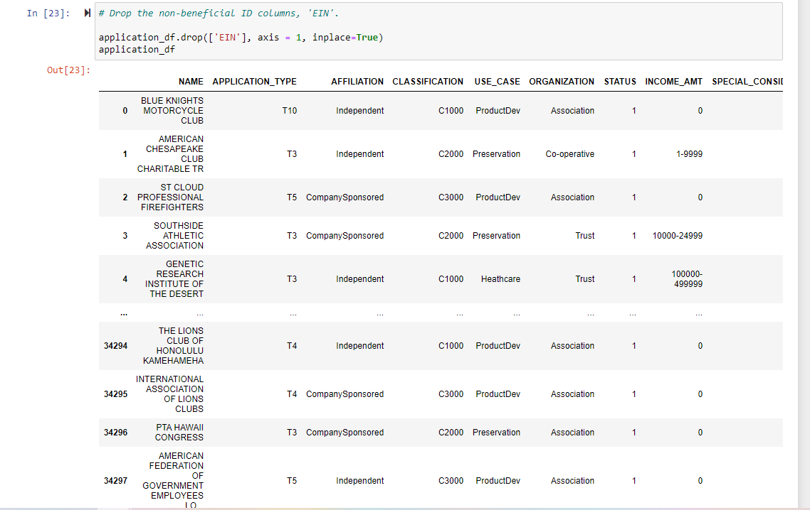
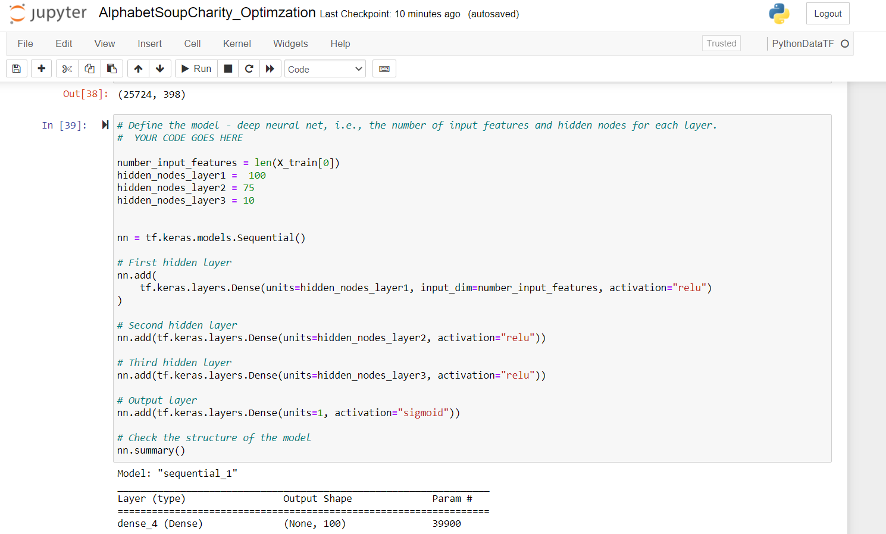
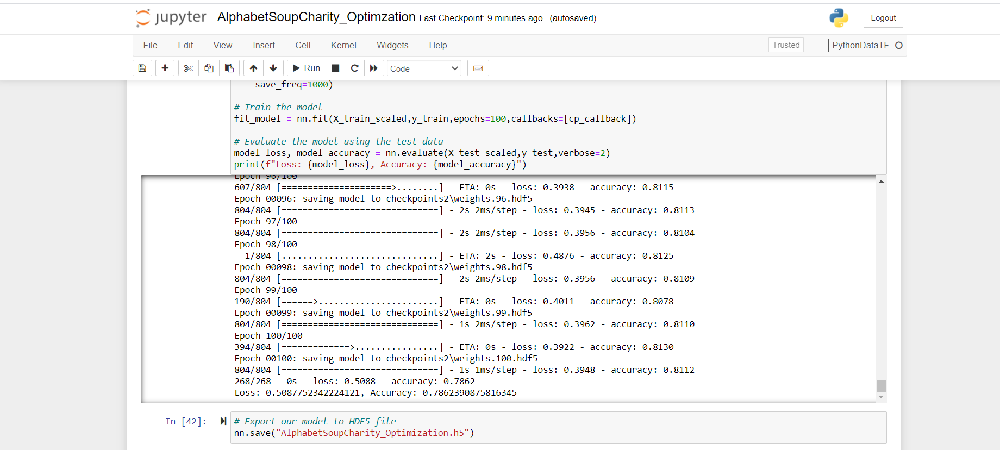

# Neural_Network_Charity_Analysis

Overview of the analysis: Explain the purpose of this analysis.

The purpose of this analysis is to use neural networks to create a binary classifier that is capable of predicting whether applicants will be successful if funded by Alphabet Soup.

### Results: 

Data Preprocessing

**What variable(s) are considered the target(s) for your model?**
The variable considered to be the target for this model is the "IS_SUCCESSFUL" column. This column indicates whether the money was used effectively. 

**What variable(s) are considered to be the features for your model?**
The variables considered to be the features for this model are:  
- NAME—Identification columns
- APPLICATION_TYPE—Alphabet Soup application type
- AFFILIATION—Affiliated sector of industry
- CLASSIFICATION—Government organization classification
- USE_CASE—Use case for funding
- ORGANIZATION—Organization type
- STATUS—Active status
- INCOME_AMT—Income classification
- SPECIAL_CONSIDERATIONS—Special consideration for application
- ASK_AMT—Funding amount requested

The "IS_SUCCESSFUL" column was **not** included as a feature for the model.

**What variable(s) are neither targets nor features, and should be removed from the input data?**
The variable considered to be neither a target nor a feature for this model is the "EIN" column. The "EIN" column is an identification column. The image below shows the dropped "EIN" column:

**Compiling, Training, and Evaluating the Model**

How many neurons, layers, and activation functions did you select for your neural network model, and why?

The number of neurons include: 100 neurons for the first layer, 75, neurons for the second layer, and 10 neurons for the third layer. 

There were a total of 3 layers used for this model.

The number of activation functions include: 2 activation functions. The "relu" activation function was used in the three hidden layers while the "sigmoid" activation function was used in the output layer. 

The neurons, layers, and activation functions described above were selected for the model to prevent overfitting of the model and for the model to produce a binary result of being either successful or not successful. 

The number of layers and number of neurons were selected to be at a reasonable number so as to not overfit the model while the sigmoid activation function was selected for the output layer to facilitate an outcome of "successful" or "not successful". The image below shows the setup for the optimized deep neural network model:

Were you able to achieve the target model performance?

Yes, I was able to achieve the target model performance of greater than 75%. The image below shows the predictive accuracy result of the model:

What steps did you take to try and increase model performance?

I changed the number of neurons and increased the number of hidden layers to be a total of three hidden layers. I also performed the process of binning/bucketing on the "NAME" column to find value counts in the column that were less than or equal to 5.

### Summary: Summarize the overall results of the deep learning model. Include a recommendation for how a different model could solve this classification problem, and explain your recommendation.

#### The overall results of the deep learning model is that it yielded a predictive accuracy of 78.6%.

A recommendation for a different model to solve this problem includes the Random Forest Model. This is because there is less code required for this machine learning model and the random forest classifier is able to train on a large dataset and predict values in seconds while the deep learning model requires a couple of minutes to train on the dataset.  
